---
## Front matter
lang: ru-RU
title: Лабораторная работа №1
author: |
	Селезнев Василий Александрович - студент группы НПМмд-02-22
date: 17.09.2022

## Formatting
toc: false
slide_level: 2
theme: metropolis
header-includes:
 - \metroset{progressbar=frametitle,sectionpage=progressbar,numbering=fraction}
 - '\makeatletter'
 - '\beamer@ignorenonframefalse'
 - '\makeatother'
aspectratio: 43
section-titles: true
---

# Работа в Git

## Прагматика выполнения

Умение пользоваться Git

## Цель выполнения лабораторной работы

Освоить на практике использование Git, Github, git flow

## Задачи выполнения работы

- Создать базовую конфигурацию для работы с git.
- Создать ключ SSH.
- Создать ключ PGP.
- Настроить подписи git.
- Зарегистрироваться на Github.
- Создать локальный каталог для выполнения заданий по предмету.

## Результаты выполнения лабораторной работы. Установил git-flow в Ubuntu

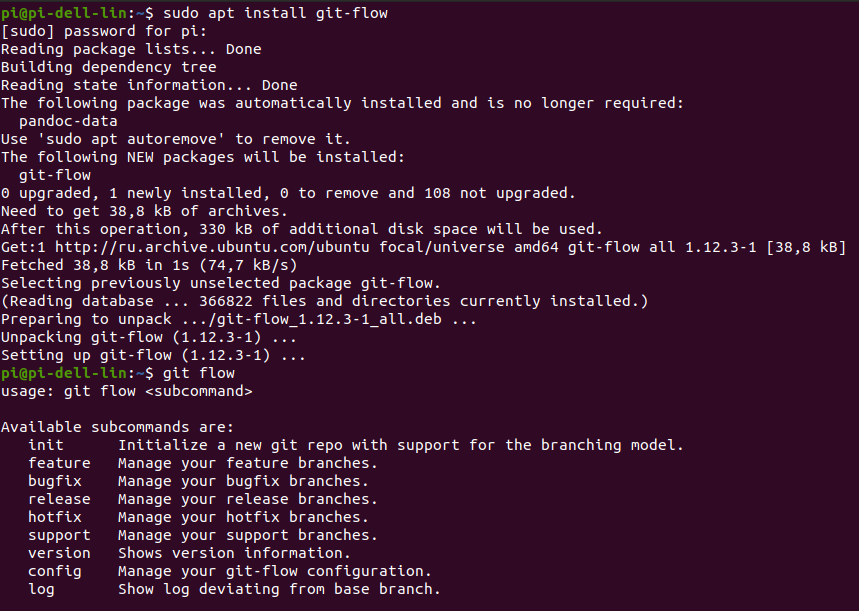{ #fig:001 width=70% }

## Установил gh

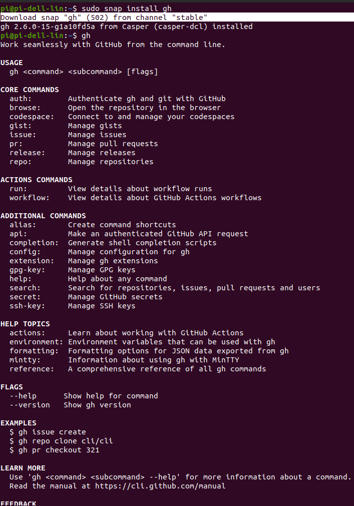{ #fig:002 width=70% }

## Задал базовую настройку git. Настроил утф-8 в выводе сообщений гит.
Зададим имя начальной ветки (будем называть её master). Настроил верификацию и подписание коммитов git.

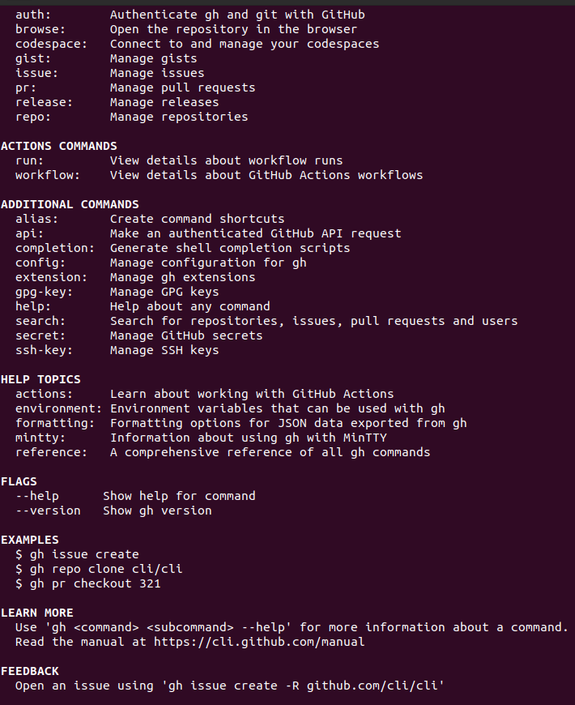{ #fig:003 width=70% }

## Создайте ключи ssh по алгоритму rsa с ключём размером 4096 бит по алгоритму ed25519

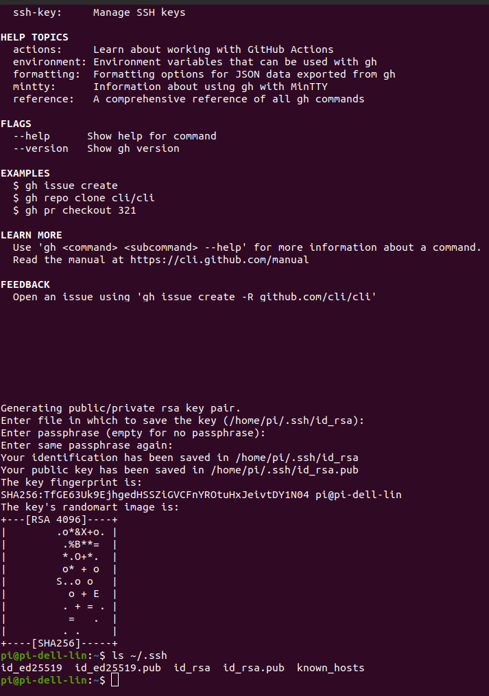{ #fig:004 width=70% }

## Создайте ключи pgp Генерируем ключ

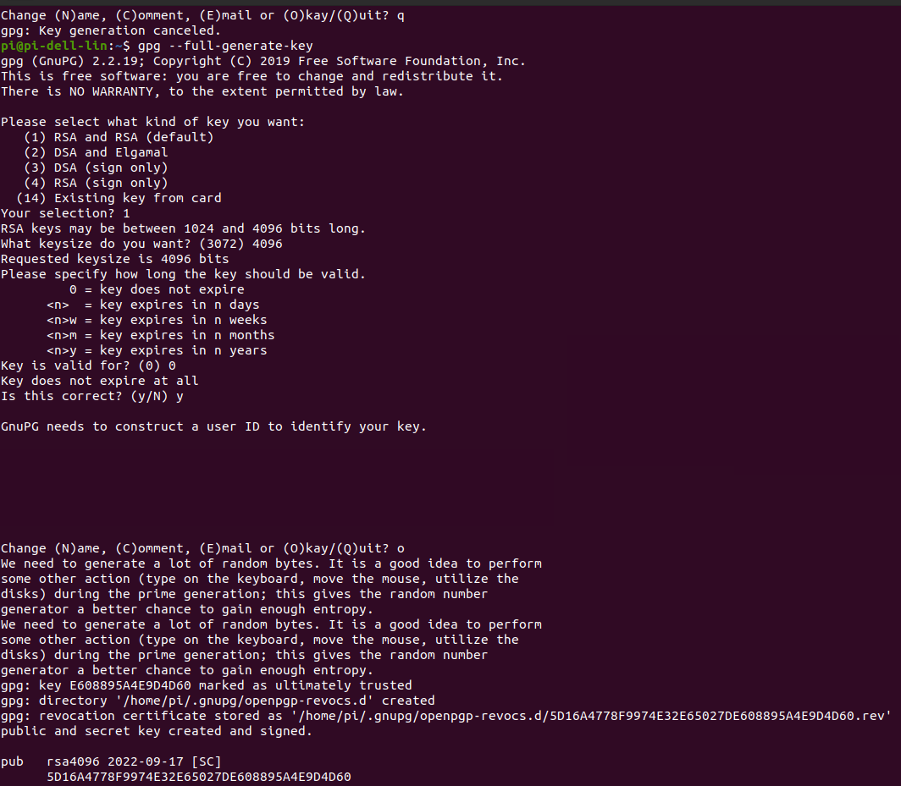{ #fig:005 width=70% }

## Добавление PGP ключа в GitHub
Выводим список ключей и копируем отпечаток приватного ключа
Cкопируйте ваш сгенерированный PGP ключ в буфер обмена

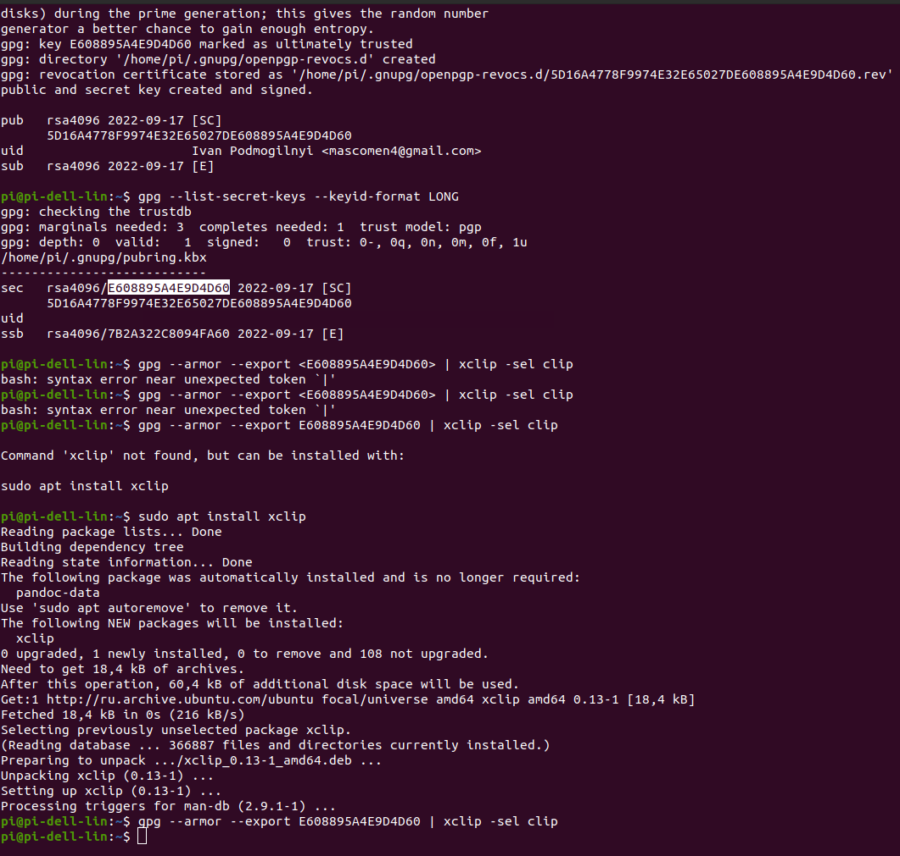{ #fig:006 width=70% }

## Настройка автоматических подписей коммитов git

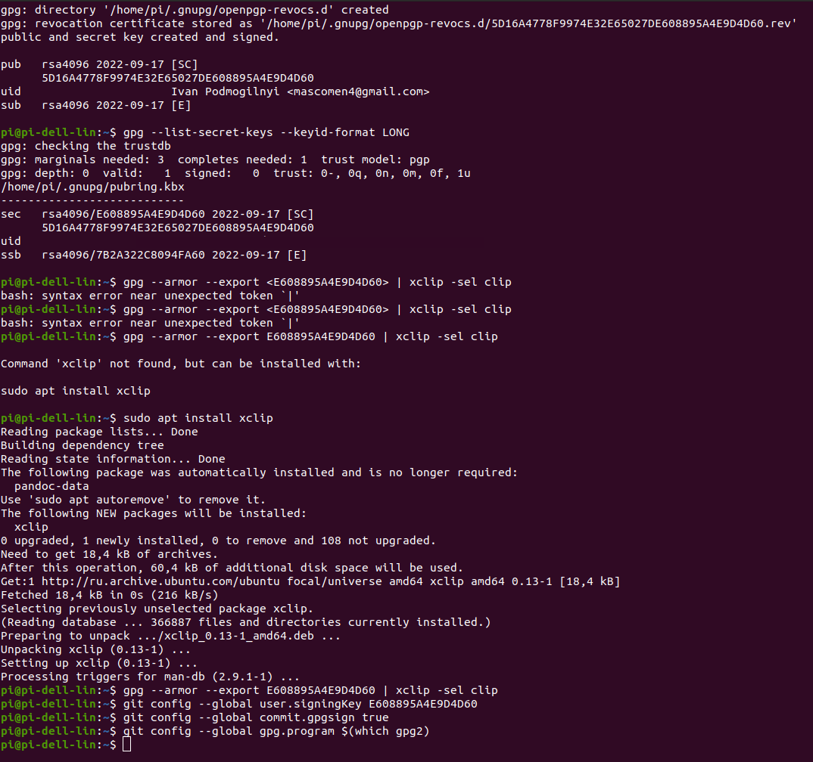{ #fig:008 width=70% }

## Настройка gh

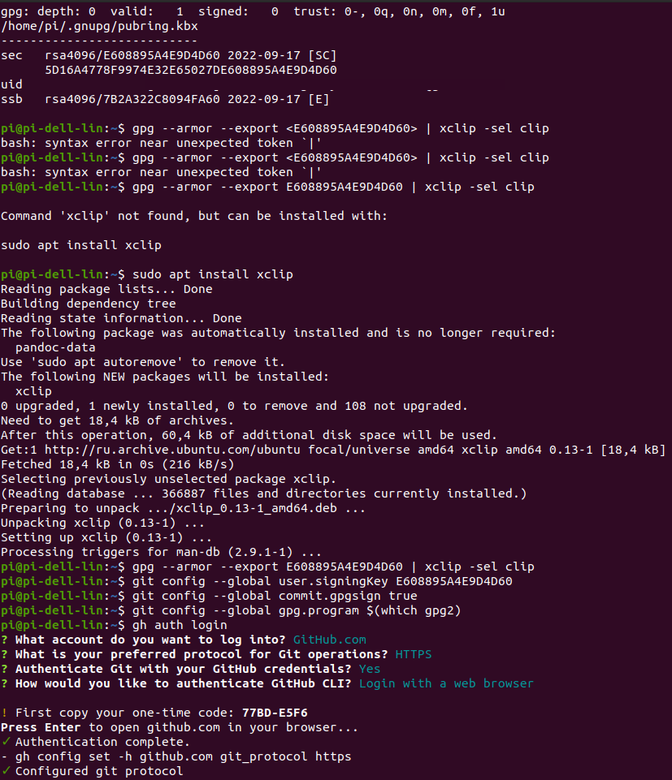{ #fig:009 width=70% }

## Необходимо создать шаблон рабочего пространства.

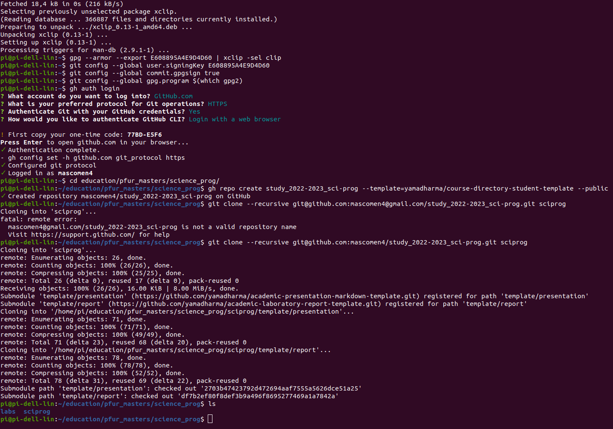{ #fig:010 width=70% }

## Перейдите в каталог курса:
Удалите лишние файлы. Создайте необходимые каталоги

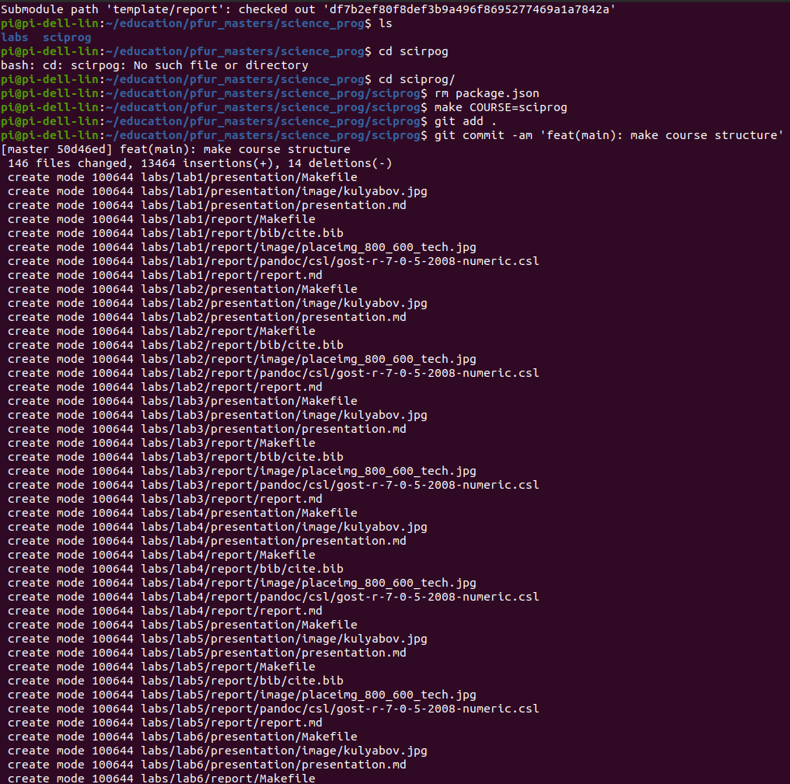{ #fig:011 width=70% }

## Отправьте файлы на сервер

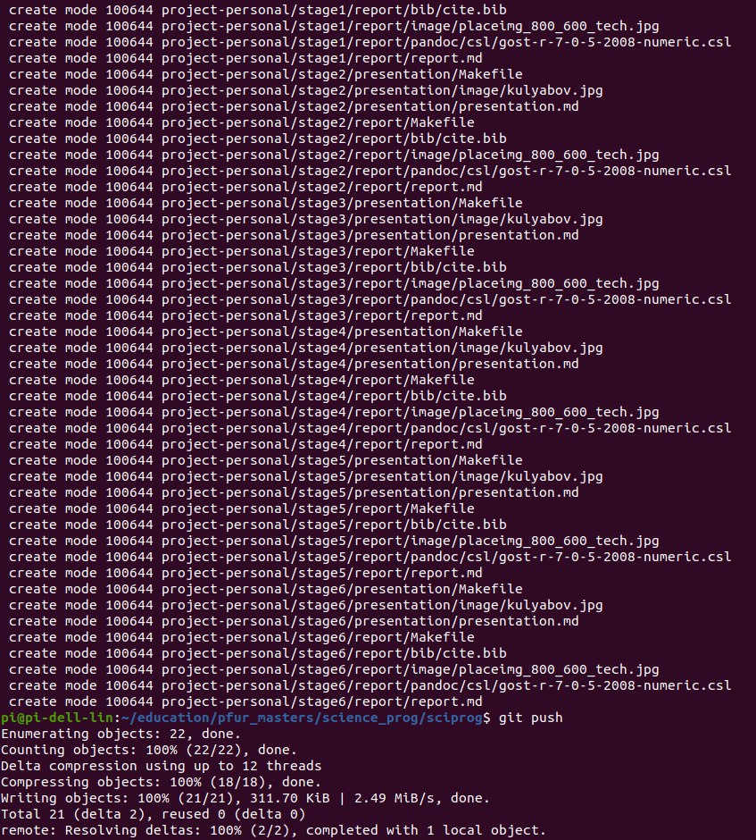{ #fig:012 width=70% }

## Выводы

Освоил на практике применение VCS Git, Github.
