---
# Front matter
title: "Научное программирование"
subtitle: "Лабораторная работа №1."
author: "Селезнев Василий Александрович."

# Generic otions
lang: ru-RU
toc-title: "Содержание"

# Bibliography

# Pdf output format
toc: true # Table of contents
toc_depth: 2
lof: true # List of figures
lot: true # List of tables
fontsize: 12pt
linestretch: 1.5
papersize: a4
documentclass: scrreprt
## I18n
polyglossia-lang:
  name: russian
  options:
  - spelling=modern
  - babelshorthands=true
polyglossia-otherlangs:
  name: english
### Fonts
mainfont: PT Serif
romanfont: PT Serif
sansfont: PT Sans
monofont: PT Mono
mainfontoptions: Ligatures=TeX
romanfontoptions: Ligatures=TeX
sansfontoptions: Ligatures=TeX,Scale=MatchLowercase
monofontoptions: Scale=MatchLowercase,Scale=0.9
## Biblatex
biblatex: true
biblio-style: "gost-numeric"
biblatexoptions:
  - parentracker=true
  - backend=biber
  - hyperref=auto
  - language=auto
  - autolang=other*
  - citestyle=gost-numeric
## Misc options
indent: true
header-includes:
  - \linepenalty=10 # the penalty added to the badness of each line within a paragraph (no associated penalty node) Increasing the value makes tex try to have fewer lines in the paragraph.
  - \interlinepenalty=0 # value of the penalty (node) added after each line of a paragraph.
  - \hyphenpenalty=50 # the penalty for line breaking at an automatically inserted hyphen
  - \exhyphenpenalty=50 # the penalty for line breaking at an explicit hyphen
  - \binoppenalty=700 # the penalty for breaking a line at a binary operator
  - \relpenalty=500 # the penalty for breaking a line at a relation
  - \clubpenalty=150 # extra penalty for breaking after first line of a paragraph
  - \widowpenalty=150 # extra penalty for breaking before last line of a paragraph
  - \displaywidowpenalty=50 # extra penalty for breaking before last line before a display math
  - \brokenpenalty=100 # extra penalty for page breaking after a hyphenated line
  - \predisplaypenalty=10000 # penalty for breaking before a display
  - \postdisplaypenalty=0 # penalty for breaking after a display
  - \floatingpenalty = 20000 # penalty for splitting an insertion (can only be split footnote in standard LaTeX)
  - \raggedbottom # or \flushbottom
  - \usepackage{float} # keep figures where there are in the text
  - \floatplacement{figure}{H} # keep figures where there are in the text
---

# Цель работы

Освоить на практике использование системы контроля версий Git.

# Задание
- Создать базовую конфигурацию для работы с git.
- Создать ключ SSH.
- Создать ключ PGP.
- Настроить подписи git.
- Зарегистрироваться на Github.
- Создать локальный каталог для выполнения заданий по предмету.

# Выполнение лабораторной работы

## Результаты выполнения лабораторной работы. Установил git-flow в Ubuntu

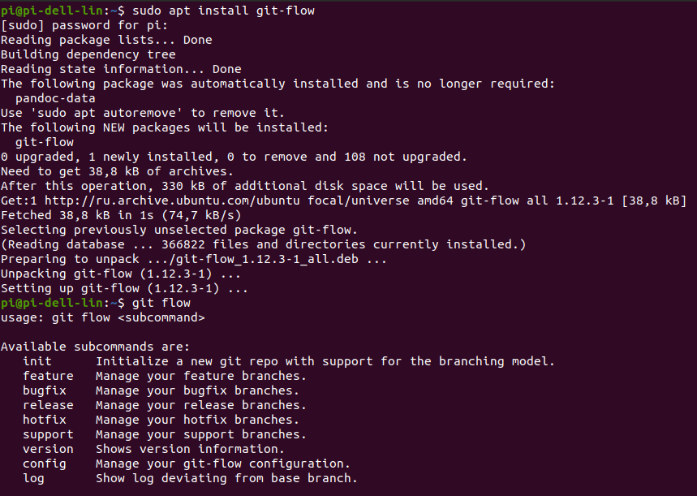{ #fig:001 width=70% }

## Установил gh

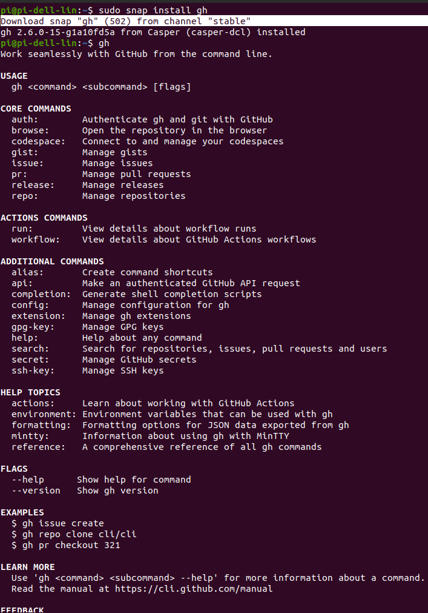{ #fig:002 width=70% }

## Задал базовую настройку git. Настроил утф-8 в выводе сообщений гит.
Зададим имя начальной ветки (будем называть её master). Настроил верификацию и подписание коммитов git.

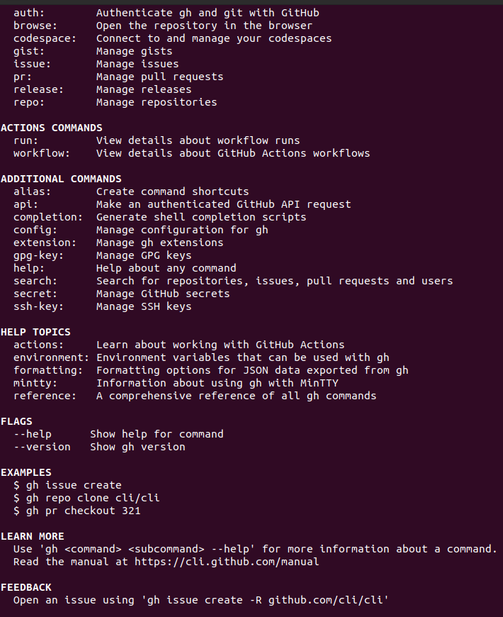{ #fig:003 width=70% }

## Создайте ключи ssh по алгоритму rsa с ключём размером 4096 бит по алгоритму ed25519

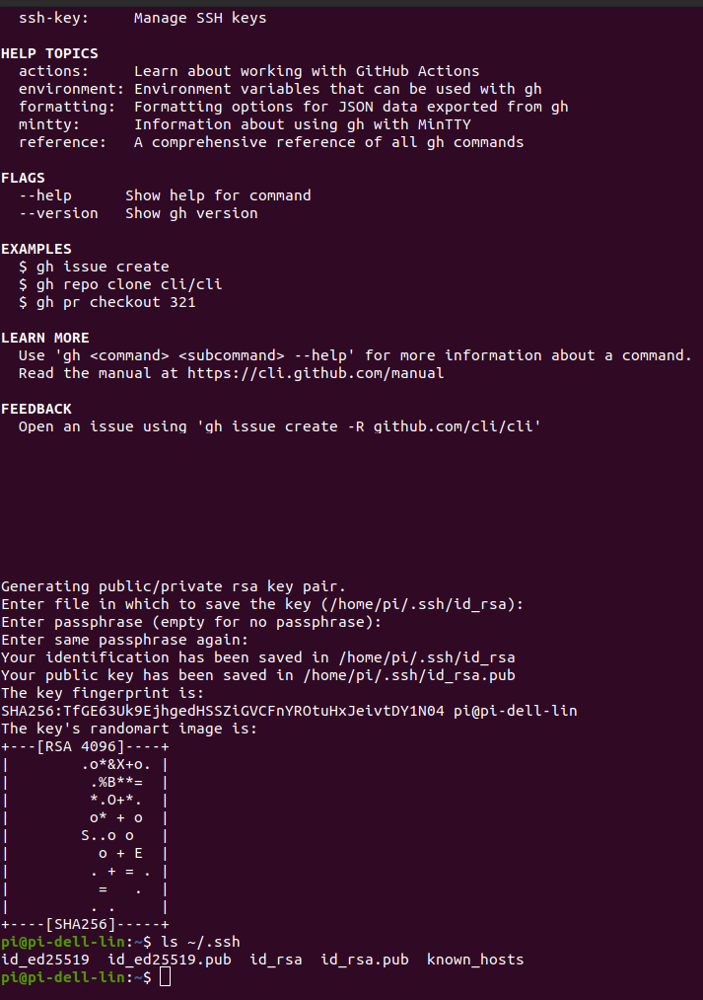{ #fig:004 width=70% }

## Создайте ключи pgp Генерируем ключ

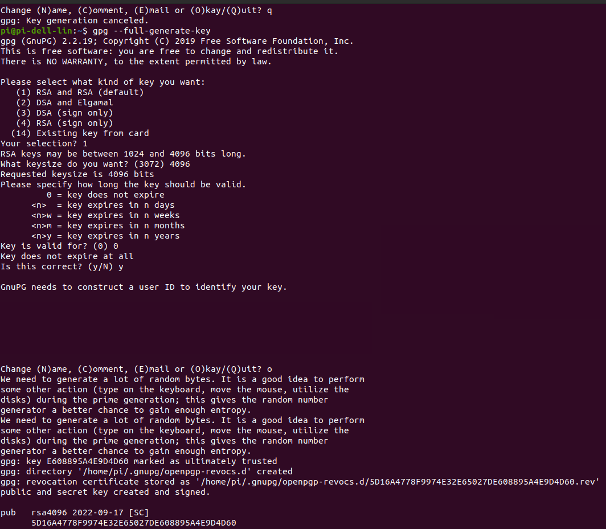{ #fig:005 width=70% }

## Добавление PGP ключа в GitHub
Выводим список ключей и копируем отпечаток приватного ключа
Cкопируйте ваш сгенерированный PGP ключ в буфер обмена

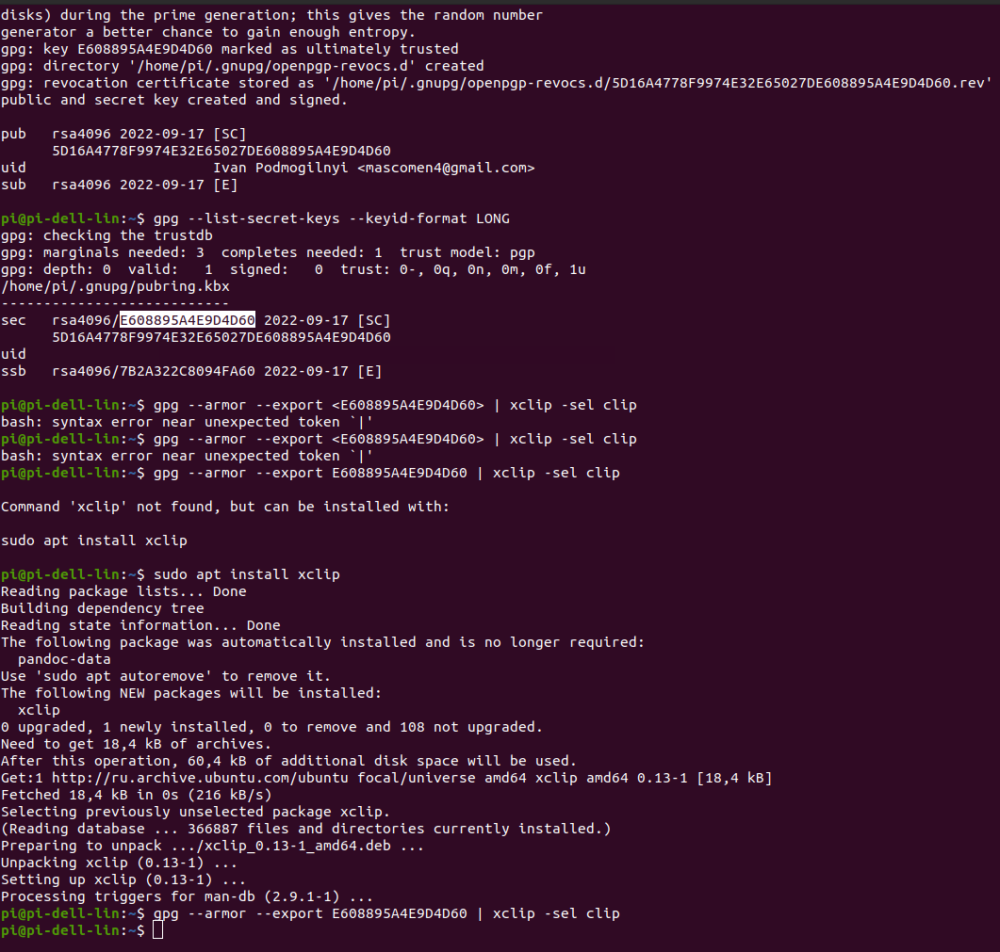{ #fig:006 width=70% }

## Настройка автоматических подписей коммитов git

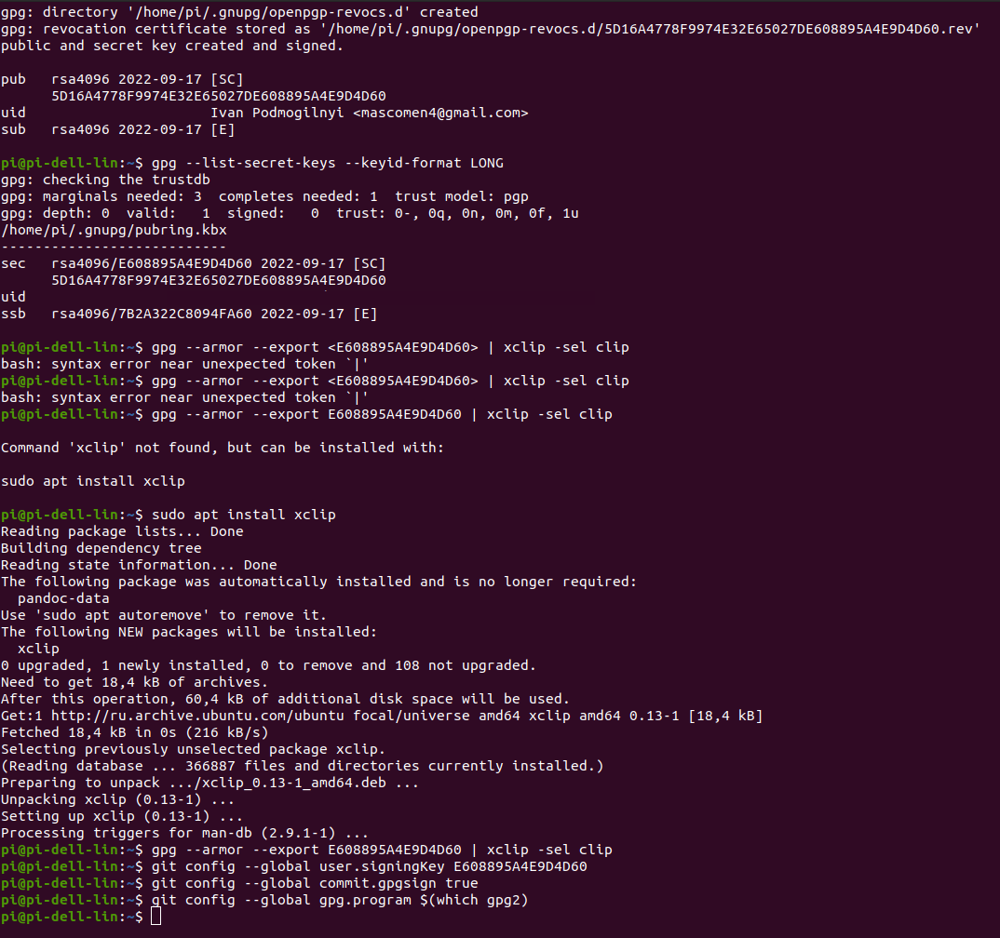{ #fig:008 width=70% }

## Настройка gh

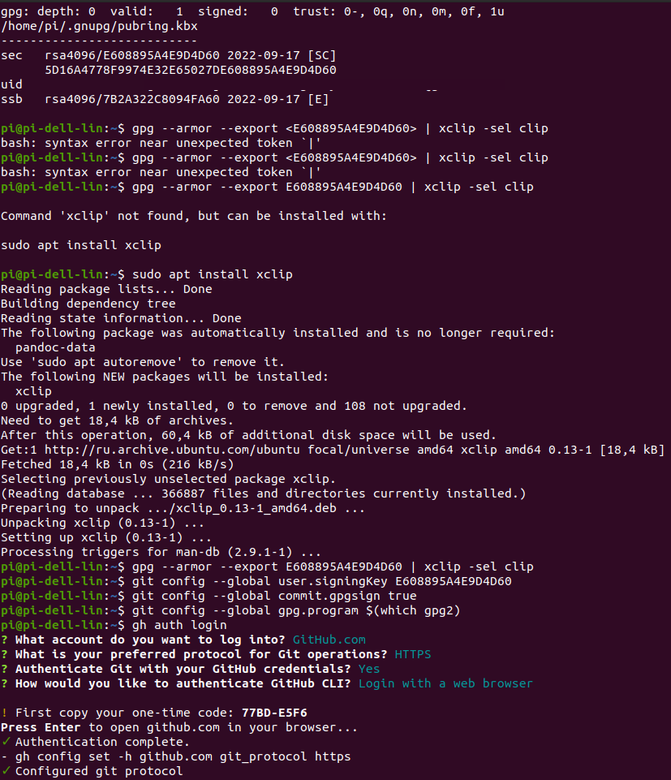{ #fig:009 width=70% }

## Необходимо создать шаблон рабочего пространства.

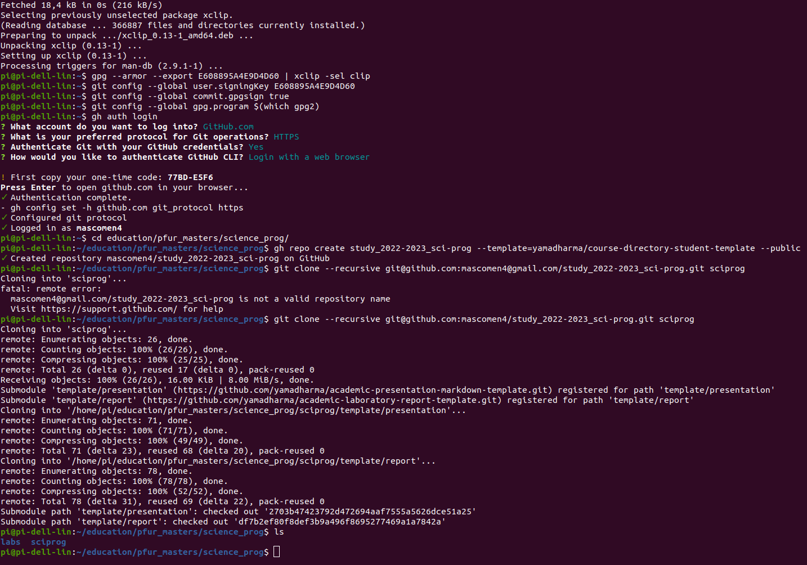{ #fig:010 width=70% }

## Перейдите в каталог курса:
Удалите лишние файлы. Создайте необходимые каталоги

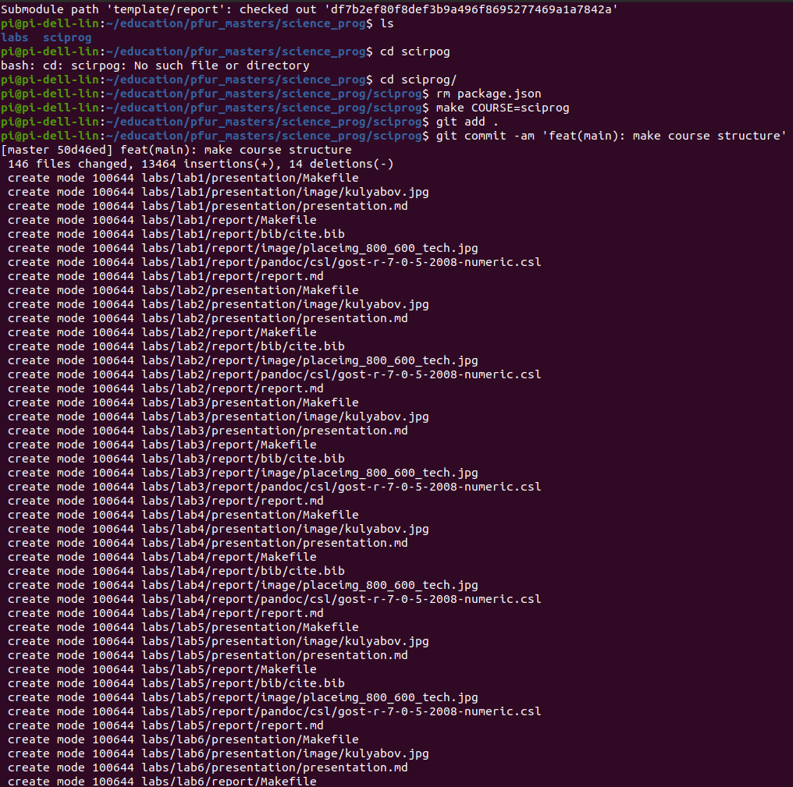{ #fig:011 width=70% }

## Отправьте файлы на сервер

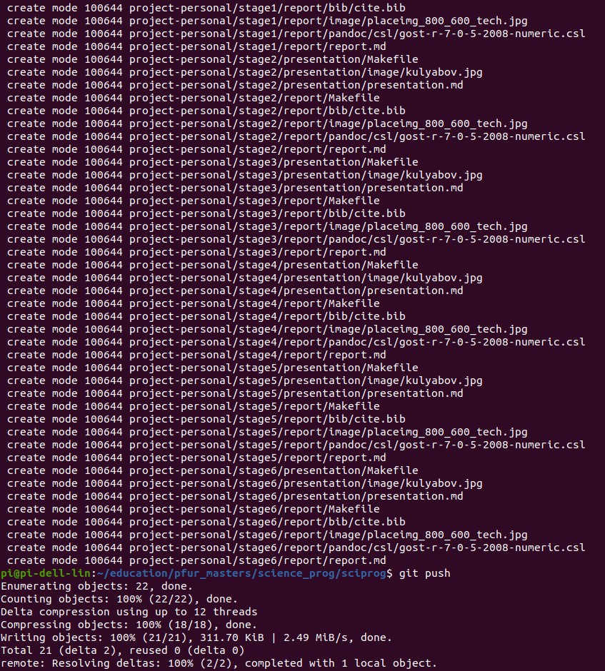{ #fig:012 width=70% }

Контрольные вопросы:  

1. Система контроля версий предназначена для ведения истории изменений. Каждое изменение добавляется через коммиты, и составляется дерево коммитов. В любой момент времени можно вернуться на любую ноду дерева  

2. Хранилище - удаленный сервер, на котором хранится проект с гит файлами, commit - изменение в проект, которре затем должно быть подтверждено командой git push. История - дерево всех коммитов. Рабочая копия - создается с помощью git clone, копия на локальной машине, в которую вносятся изменения. Они могут быть загружены на сервер через коммиты.  

3. Централизованные системы используют единственный сервер, содержащий все версии файлов, и некоторое количество клиентов, которые получают файлы из этого централизованного хранилища. Примеры: CVS, Subversion и Perforce  

4. При единоличной работе с хранилищем применяются такие же правила как и при работе с общим хранилищем (см. пункт 5)  

5. При работе с общим хранилищем необходимо для каждой функции строго добавлять новую ветку feature, реализовывать её и слиять с веткой develop  

6. Защищает исходный код от потери, обеспечивает командную работу, помогает отменить изменения, распределённая работа  

7. git add, git commit, git push, git remote, git clone, git flow, git branch, git merge, git checkout, git pull, git init, git config  

8. Если нужно вести систему контроля, но в целом мы не делимся кодом с командой, и нам не нужно иметь доступ к коду с разных устройств, которые практически никак не связаны с нашей локальной сетью, то можно использовать локальные репозитории. В противном случае нужно использовать удаленные репозитории  

9. Ветви - отдельные истории в СКВ, которые позволяют вести разработки параллельно. Над двумя ветками могут работать две разные комманды, а затем их можно слить в одну  

10. Через файл .gitignore. Тутор: https://git-scm.com/docs/gitignore Зачем? Потому что некоторые файлы могут быть слишком большими: бинарники, словари, видео, изображения

# Выводы

Освоил на практике применение методов шифрования Цезаря и Атбаша.
